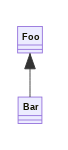

# template-wasm-rust-library

> Project template for a Rust library compiled to WASM.

## Usage

1. Use as a
   [template](https://docs.github.com/en/github/creating-cloning-and-archiving-repositories/creating-a-repository-from-a-template)
   to create a new repository.
2. Update links and references in `README.md`.

## Development

Install [wasm-pack](https://rustwasm.github.io/wasm-pack/):
`cargo install wasm-pack`

Install [Firefox](https://www.mozilla.org/firefox/browsers)

Build: `wasm-pack build --target web`

Test: `wasm-pack test --headless --firefox`

Lint: `cargo fmt`

## Documentation

### Overview

PNG image generated from `images/uml_diagram.mermaid`:

### API

Link to auto-generated API docs for the library:

[API Documentation](https://docs.rs/flowscripter_template_wasm_rust_library)

## License

MIT © Flowscripter
